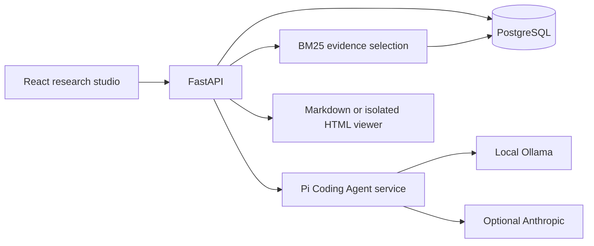

# Architecture

The browser talks only to FastAPI. FastAPI owns PostgreSQL persistence, session ownership checks, retrieval, route selection, citation validation, and artifact records. A private Node service uses the actual Pi Coding Agent SDK for generation. It exposes no filesystem, shell, extension, or browsing tools.

## Data model

- sessions: UUID, browser workspace owner, title, user metadata, creation/update timestamps.
- messages: UUID, session foreign key, role, text, JSON details containing sources, provider/model, timings, warnings, artifact reference.
- artifacts: UUID, session/message foreign keys, title, format, content, citation snapshots, timestamp.
- transcripts: upstream guest slug, guest, title, source URL, video URL, SHA-256 content hash and index timestamp.
- chunks: UUID, transcript foreign key, position, text and available timestamp. Unique transcript/position constraint.

Foreign keys enforce relationships. Writes for each successful user/assistant turn and artifact are atomic. A PostgreSQL row lock rejects simultaneous writes to the same conversation. Model errors roll back the turn; the UI preserves the draft. Conversations are read from PostgreSQL on reopening. Pi sessions are in-memory per request, seeded only with bounded history from the requested database session.

## API

| Method | Endpoint | Purpose |
|---|---|---|
| GET | /api/health/live | Process health |
| GET | /api/health/ready | Database and knowledge readiness |
| GET | /api/status | Corpus counts, agent and model availability |
| GET / POST | /api/sessions | List or create browser-owned chats |
| GET / DELETE | /api/sessions/{id} | Read or delete owned chat and artifacts |
| POST | /api/sessions/{id}/messages | Generate and persist a turn |
| GET | /api/library?q= | Browse transcript metadata |

FastAPI serves the built frontend at /. Interactive OpenAPI documentation is at /docs. API errors have an error object with code, message and request_id. Inputs validate UUIDs, provider/mode enums, metadata limits and message lengths. The browser sends X-Workspace-ID, a locally generated random UUID. This is separation for local evaluation, not identity verification.

## Ingestion and retrieval

The fetch script downloads the assignment's upstream corpus at a recorded Git revision. The ignored manifest records that revision. The ingestion CLI parses YAML metadata, splits into 240-word chunks with 40-word overlap, stores source paths/timestamps, and replaces only changed transcripts based on SHA-256. Refresh is a transaction. Removed upstream transcripts are not automatically deleted; removal requires an explicit maintenance decision.

BM25 runs over the body text of persisted chunks in API memory. When a guest is explicitly named, their name is removed from topical scoring and retrieval is restricted to the named guest’s episodes and their episode receives a ranking boost; introductory/promotional passages are downweighted. This avoids repeated speaker labels dominating useful evidence. IDF uses positive smoothing so relevant terms work in small corpora as well as the full collection. Stop words are removed, a minimum distinct-term overlap is required, and at most two passages per transcript enter a five-passage context. A reference-bearing follow-up includes the previous two user questions; a new topic does not. This is lexical retrieval: paraphrases, ambiguous intent, negation and speaker attribution can still require human review. The API index reloads on restart after ingestion.

## Agent boundary

Routing is explicit when a UI mode is selected and uses bounded rules when mode=auto. The agent loads the essay skill only for essay generation. It composes an opening, five body sections and a takeaway using isolated Pi sessions with shared evidence and a compact outline, measures each section, and may request one extra section if the draft is short. A bounded single repair handles missing citations for other routes. Prompt assembly separates task, history and evidence. History is limited to six messages. Ordinary messages receive 600 characters; the latest artifact linked to those messages receives up to 2,400 characters so follow-up edits can use its contents. Old citations are remapped by chunk ID to current evidence labels, or marked for re-verification when that source is absent. This preserves room for evidence and output in the configured 8,192-token local context. The model is instructed to treat evidence as data. Citation labels are checked after generation; unknown or missing labels reject the response. This does not establish semantic correctness. The UI provides the underlying evidence for verification.

Ollama uses the OpenAI-compatible endpoint through Pi. Anthropic uses Pi's provider integration. Configuration controls model names and endpoints; no application code change is needed to switch. The provider is recorded per answer. There is no automatic fallback to cloud, avoiding unexpected costs or data transfer. The agent handles one request at a time to bound local memory, returning a retryable busy response for concurrent generations.

## Artifact security

Markdown renders with raw HTML disabled and remote images removed. HTML is sanitized using DOMPurify with a narrow tag/attribute allowlist. Scripts, forms, frames, links, external images, SVG, event handlers and generated meta elements are removed. The sanitized document is placed into an iframe with an empty sandbox attribute. A prepended CSP blocks scripts, connections, images, fonts, frames, objects, forms and base changes; only inline CSS is allowed. Even CSS URLs cannot fetch remote data. The iframe has an opaque origin, no parent DOM access and no navigation privileges. HTML downloads use the same cleaned document and CSP. Source inspection displays text, never injected markup.

## Operation and limits

Docker Compose provides PostgreSQL, Ollama, model initialization, transcript ingestion, the agent and app. Only FastAPI is published, bound to loopback. The portable Windows workflow uses the same application code and a project-local PostgreSQL/Ollama runtime. Structured logs report request IDs, paths, statuses, modes, counts and timings; prompts, credentials and transcript passages are not logged. PostgreSQL backups can use pg_dump.

This is a local evaluation deployment. Before internet exposure, add real identity/authentication, authorization, rate limiting, TLS, resource quotas, managed secrets, migrations and a monitored worker queue. Automatic schema creation supports a fresh evaluator setup; it is not a schema migration system.

Overlong essays receive conservative paragraph editing: repeated supporting prose may be removed, while the opening, section headings/leads, lists and complete takeaway are preserved. No sentence is cut. The final length is checked again and any remaining deviation is shown.

To avoid repeating expensive generation when the API connection is interrupted, the private agent keeps up to 20 exact-input results for 24 hours under ignored .runtime/generations. Cache keys include the model, evidence, task and bounded history. Cached content is application data, not a log; it stays on the local machine. PostgreSQL remains the durable conversation store. Retrying the same uncommitted request can reuse the completed generation after an API restart.

## Render demo deployment

See docs/render-deployment.md and render.yaml. Free Render hosting uses one Docker container with a loopback-only Pi agent and a single FastAPI worker, plus free PostgreSQL. A supervisor imports 40 pinned real transcripts before launching services and shuts down both if either exits. This bounds corpus memory; the local installation retains the full corpus. Production adds HTTPS Basic reviewer access, an agent token, one active generation, and a global in-process hourly attempt limit. Health liveness is public; other routes require reviewer credentials. The workspace UUID remains a browser-owned session boundary, not an individual user account. Free hosting does not supply an AI model. Use one worker/replica; a scaled deployment requires shared job/limit infrastructure.
